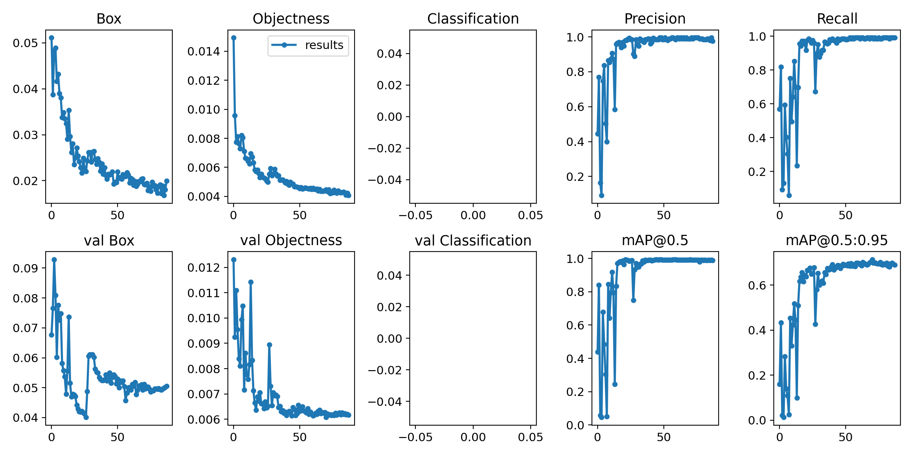
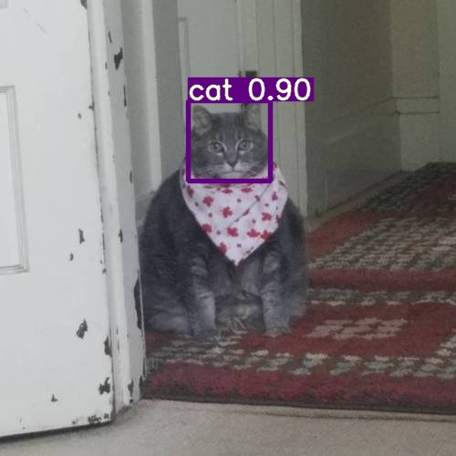

# Распознование кошек по лицу/мордочке


### Данные: 
1500 фотографий кошек были размечены через labelImg для обучающей, 200 для контрольной. 

### Модель: 
YOLOv7-X

```
batch-size 16 
epochs 100 
img 640 640
```

## Метрики


## Демонстрация работы



